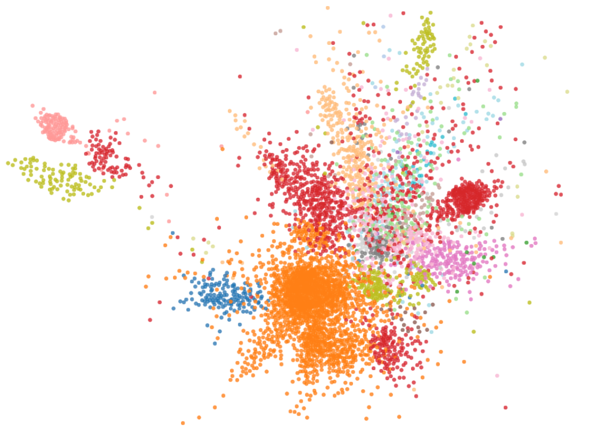

# Pandemaniac

*CS144 Network Economics course project, Caltech, spring 2018. Contributor: Botao Hu, Guanya Shi and Hangwen Lu as __[Team Kaigoo]__.*

## Rule of the game

On an undirected graph, each team chooses a list of N seed nodes (where N is given). The goal is to spread the epidemics and take over more of the network (i.e., a larger number of nodes) with epidemic than competitors do with theirs.

If more than one team chooses the same node as a seed node, the node will be cancelled such that no team owns that node.

From the seed nodes, the epidemics spread iteratively. During each iteration, every node chooses its next color through a majority vote among itself and its direct neighbors. All colored direct neighbors of the node vote for their respective color with 1 vote; however, if the node itself is currently colored, it votes for its own color with 1.5 votes. If any color has a strict majority out of the total number of votes, then that becomes the next color for the node. If there is no strict majority, then the node keeps its current color or remains uncolored.

The termination of one game is limited by the number of iteration. A typical result of one game is shown below.

## Strategy

__Clustering methods__: the main idea is to partition the graph into sub-graphs, so that we can either focus our attack on one big subgraph, or put our soldiers separately in each sub-graph.

* __Laplacian Embedding__: embed the graph in a 2-dimensional Euclidean space by taking the first 2 eigenvectors of non-null eigenvalues and generate a 2-D spectral distribution all nodes.

* __Spectral clustering__: partition on the Laplacian spectrum since the clusters are separated spatially, using ’nearest_neighborhood’ method.

__Centrality measures__: measuring the "importance" of nodes is the key to this problem.

* Degree centrality
* Closeness centrality
* Betweeness centrality
* Mixed centrality

__Game Theoretical Principles__: collision avoidance is a key part in designing algorithms, which is done by using random strategy and delibrately abandoning part of the top centralized nodes.

## Usage

* See `./simrun_final.py` for our ultimate strategy.
* Consult `./sklearn_clustering_trial.ipynb` and `spectral_partition.py` for our research process.
